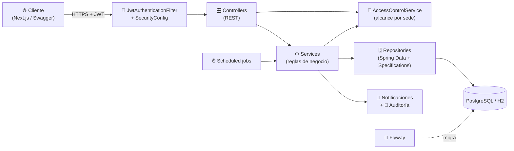

<div align="center">

# 🏟️ Court Reservation API

**Backend del sistema de reservas de canchas deportivas multi-sede**

Reservas con precios dinámicos · paquetes prepagados · pagos · comunidad (partidos, equipos, torneos) · reportes · roles por sede

[](https://github.com/Rodrigo-Salva/court-reservation-api/actions/workflows/ci.yml)


[Inicio rápido](#-inicio-rápido) · [Funcionalidades](#-funcionalidades) · [Arquitectura](#-arquitectura) · [API](docs/API.md) · [Reglas de negocio](docs/BUSINESS_RULES.md) · [Modelo de datos](docs/DATA_MODEL.md) · [Despliegue](docs/DEPLOYMENT.md)

</div>

---

## 📑 Tabla de contenidos

1. [Funcionalidades](#-funcionalidades)
2. [Stack tecnológico](#-stack-tecnológico)
3. [Arquitectura](#-arquitectura)
4. [Inicio rápido](#-inicio-rápido)
5. [Configuración](#-configuración)
6. [Roles y permisos](#-roles-y-permisos)
7. [Seguridad](#-seguridad)
8. [API](#-api)
9. [Datos de demostración](#-datos-de-demostración)
10. [Tareas programadas](#-tareas-programadas)
11. [Pruebas](#-pruebas)
12. [Integración continua](#-integración-continua)
13. [Estructura del proyecto](#-estructura-del-proyecto)
14. [Documentación adicional](#-documentación-adicional)

---

## ✨ Funcionalidades

| Módulo | Qué incluye |
|---|---|
| 📅 **Reservas** | Reserva simple y recurrente (2 a 12 semanas), disponibilidad por cancha, reprogramación, cancelación con penalizaciones, check-in por QR y no-show |
| 💸 **Precios dinámicos** | Recargos por horario pico y fin de semana, descuento en horario valle, descuento por membresía y por reserva recurrente |
| 📦 **Paquetes** | Compra de horas prepagadas con vigencia; las horas se descuentan al reservar y se devuelven al cancelar a tiempo |
| ⏳ **Lista de espera** | Cola FIFO por cancha, fecha y horario; aviso al primero cuando se libera el turno, con 30 min para responder |
| 💳 **Pagos** | Pago simulado (tarjeta, Yape/Plin, efectivo), panel administrativo, reembolsos y **pago obligatorio opcional** con expiración automática |
| ⭐ **Reseñas** | Solo tras completar una reserva; moderación (ocultar, mostrar, eliminar) por sede |
| 🤝 **Comunidad** | Partidos abiertos con solicitudes que acepta o rechaza el creador, equipos con **invitaciones por email**, torneos round-robin con fixture, resultados y ranking |
| 🏢 **Multi-sede** | Sedes, canchas asignables entre sedes y **roles acotados a su sede** (`VENUE_ADMIN`, `RECEPTIONIST`) |
| 📊 **Reportes** | Reservas, ingresos, cancelaciones, no-show y horas pico, filtrables por sede, cancha y deporte; exporta **PDF, XLSX y CSV** |
| 🔔 **Notificaciones** | Bandeja in-app para reservas, pagos, lista de espera, recordatorios e invitaciones |
| 🧾 **Auditoría** | Registro de acciones sobre reservas, con alcance por sede |
| 🛡️ **Seguridad** | JWT, revocación al cerrar sesión, límite de intentos de login, autorización por rol y por sede |

---

## 🧰 Stack tecnológico

| Capa | Tecnología |
|---|---|
| Lenguaje / runtime | Java 21 |
| Framework | Spring Boot 3.2.1 (Web, Data JPA, Validation, Security, Actuator) |
| Persistencia | Hibernate 6.4 · H2 (desarrollo) · PostgreSQL (producción) · **Flyway** (migraciones) |
| Autenticación | Spring Security 6.2 + JWT (`jjwt` 0.12.3, HS256) + BCrypt |
| Mapeo / boilerplate | MapStruct 1.5.5 · Lombok 1.18.34 |
| Reportes | Apache POI 5.2.5 (XLSX) · OpenPDF 1.3.39 (PDF) |
| Documentación | springdoc-openapi 2.6.0 (Swagger UI) |
| Configuración | `spring-dotenv` (lee `.env` en local) |
| Pruebas | JUnit 5 · Mockito · `@DataJpaTest` (H2) |
| CI | GitHub Actions |

---

## 🏗️ Arquitectura



**Capas y responsabilidades**

- **`controller/`** expone la API REST y resuelve el usuario autenticado (`@AuthenticationPrincipal`).
- **`service/`** concentra las reglas de negocio (`BookingServiceImpl`, `ReportService`, `TeamInvitationService`, …).
- **`security/`** contiene JWT, `SecurityConfig` (roles por URL) y `AccessControlService`, que decide **qué sede** puede ver o modificar cada usuario.
- **`repository/`** usa Spring Data JPA; los listados filtrables usan `Specification` en `repository/spec/`.
- **`entity/` · `dto/` · `mapper/`** separan el modelo persistente de lo que expone la API.

**Autorización en dos niveles.** Primero `SecurityConfig` decide qué *roles* llegan a una URL; después `AccessControlService` restringe *qué datos* ve el personal de sede. Si un `VENUE_ADMIN` o `RECEPTIONIST` no tiene sede asignada, el sistema **falla cerrado** (403).

---

## 🚀 Inicio rápido

### Requisitos

- **JDK 21**. Nada más para desarrollo: usa H2 en memoria (Maven Wrapper incluido: `./mvnw`).

### 1. Clonar y configurar el secreto JWT

```bash
git clone https://github.com/Rodrigo-Salva/court-reservation-api.git
cd court-reservation-api
cp .env.example .env
```

Genera un secreto (Base64, mínimo 32 bytes) y pégalo en `JWT_SECRET` dentro de `.env`:

```bash
# Linux / macOS / Git Bash
openssl rand -base64 32
```

```powershell
# Windows PowerShell
$b = New-Object byte[] 32; [Security.Cryptography.RandomNumberGenerator]::Fill($b); [Convert]::ToBase64String($b)
```

> `spring-dotenv` carga `.env` automáticamente al arrancar. El archivo está en `.gitignore`: **nunca lo subas**.

### 2. Ejecutar

```bash
./mvnw spring-boot:run          # Windows: mvnw.cmd spring-boot:run
```

La API queda en **http://localhost:8080** con el perfil `dev` (H2 en memoria + datos de demostración).

| Recurso | URL |
|---|---|
| 📘 Swagger UI | http://localhost:8080/swagger-ui.html |
| 🗄️ Consola H2 | http://localhost:8080/h2-console (JDBC `jdbc:h2:mem:courtdb`, usuario `sa`, sin contraseña) |
| ❤️ Salud | http://localhost:8080/actuator/health |

### 3. Probar

Inicia sesión con una cuenta de [demostración](#-datos-de-demostración) y usa el token en Swagger (*Authorize*):

```bash
curl -X POST http://localhost:8080/api/auth/login \
  -H "Content-Type: application/json" \
  -d '{"email":"admin@sportsbooking.com","password":"admin123"}'
```

---

## ⚙️ Configuración

### Variables de entorno

| Variable | Obligatoria | Descripción |
|---|:---:|---|
| `JWT_SECRET` | ✅ siempre | Secreto Base64 de ≥ 32 bytes para firmar los JWT |
| `SPRING_PROFILES_ACTIVE` | prod | `prod` para producción (por defecto `dev`) |
| `DB_URL` | prod | p. ej. `jdbc:postgresql://localhost:5432/courtdb` |
| `DB_USERNAME` · `DB_PASSWORD` | prod | Credenciales de PostgreSQL |
| `CORS_ALLOWED_ORIGINS` | prod | Orígenes permitidos, separados por coma |

### Perfiles

| | `dev` (por defecto) | `prod` |
|---|---|---|
| Base de datos | H2 en memoria | PostgreSQL |
| Esquema | Hibernate `create-drop` | **Flyway** (`db/migration`) + Hibernate `validate` |
| Datos de prueba | ✅ `DataLoader` + `DemoDataSeeder` | ❌ ninguno |
| SQL en logs / consola H2 | ✅ | ❌ |

### Reglas de negocio configurables (`application.yml`)

| Propiedad | Por defecto | Efecto |
|---|---|---|
| `app.business-rules.booking.require-payment` | `false` | Si es `true`, las reservas nuevas quedan **PENDIENTE** hasta que se pagan |
| `app.business-rules.booking.payment-window-minutes` | `15` | Plazo para pagar; vencido, la reserva se cancela sola y libera el horario |
| `app.security.jwt.expiration` | `86400000` | Vida del token en ms (24 h) |

> Los detalles de precios, membresías y cancelaciones están en [docs/BUSINESS_RULES.md](docs/BUSINESS_RULES.md).

---

## 👥 Roles y permisos

| Rol | Alcance |
|---|---|
| `USER` | Reserva, paga, compra paquetes, entra a lista de espera, reseña, participa en partidos, equipos y torneos |
| `RECEPTIONIST` | **Su sede**: consulta reservas, hace check-in (manual o por QR), marca no-show, ve bloqueos |
| `VENUE_ADMIN` | **Su sede**: canchas, bloqueos, pagos y reembolsos, reseñas, reportes, auditoría, torneos y check-in |
| `ADMIN` | Todo el sistema, incluida la gestión de usuarios y paquetes |
| `SUPER_ADMIN` | Sedes y personal de sede, más las funciones de `VENUE_ADMIN` sobre todas las sedes |

Un `VENUE_ADMIN` o `RECEPTIONIST` **debe tener una sede asignada**. Un `ADMIN` o `SUPER_ADMIN` crea al personal con `POST /api/users/staff` o asigna sede a un usuario existente con `PATCH /api/users/{id}/venue`.

La matriz completa por endpoint está en [docs/API.md](docs/API.md#-matriz-de-acceso).

---

## 🔐 Seguridad

- **Contraseñas** con BCrypt; el JWT (HS256) dura 24 h y **se valida contra el usuario en cada petición**.
- **Logout real**: `POST /api/auth/logout` incrementa la `token_version` del usuario e invalida todos sus tokens.
- **Anti fuerza bruta**: 5 intentos fallidos por email + IP bloquean el login 15 minutos (HTTP `429` con `Retry-After`). El contador vive en memoria; con varias réplicas conviene moverlo a Redis.
- **Alcance por sede** en canchas, bloqueos, pagos, reportes, reseñas, auditoría, torneos y check-in.
- **Secretos fuera del código**: nada sensible se versiona; en producción se inyectan por variables de entorno.
- **Errores coherentes**: `400` (JSON o parámetros inválidos), `403`, `404`, `429`; una entrada inválida del cliente no produce `500`.
- **Actuator**: solo `health` e `info` son públicos.

---

## 🔌 API

- **Documentación interactiva:** `/swagger-ui.html` (con botón *Authorize* para el JWT).
- **Referencia por módulo y rol:** [docs/API.md](docs/API.md).
- **Listados paginados:** `GET /api/payments`, `/api/court-reviews/moderation`, `/api/audit-logs`, `/api/bookings/search` y `/api/users/page` aceptan `page` (desde 0) y `size` (máx. 100) y responden:

```json
{
  "content": [],
  "page": 0,
  "size": 20,
  "totalElements": 42,
  "totalPages": 3
}
```

---

## 🌱 Datos de demostración

En el perfil `dev` cada tabla arranca con **al menos 10 registros** coherentes entre sí (reservas en todos los estados, pagos aprobados, rechazados y reembolsados, un torneo en curso con ranking, invitaciones de equipo, etc.). Se reconstruyen en cada reinicio.

| Cuenta | Contraseña | Rol |
|---|---|---|
| `admin@sportsbooking.com` | `admin123` | `ADMIN` |
| `venueadmin@sportsbooking.com` | `venue123` | `VENUE_ADMIN` · Sede Central |
| `recepcion@sportsbooking.com` | `recep123` | `RECEPTIONIST` · Sede Central |
| `norteadmin@sportsbooking.com` | `norte123` | `VENUE_ADMIN` · Sede Norte |
| `demo01@…` a `demo12@sportsbooking.com` | `demo123` | `USER` (membresías: ninguna, básica, premium y VIP en rotación) |

> ⚠️ Son credenciales de desarrollo. No existen en producción.

---

## ⏰ Tareas programadas

| Frecuencia | Tarea |
|---|---|
| Cada minuto | Cancela las reservas **pendientes de pago** cuyo plazo venció |
| Cada 5 min | Vence avisos de lista de espera y notifica al siguiente |
| Cada hora | Marca como completadas las reservas ya finalizadas · envía recordatorios de reservas próximas |
| Diaria 02:00 | Desactiva los paquetes vencidos |
| Diaria 03:00 | Limpia solicitudes antiguas de la lista de espera |

---

## 🧪 Pruebas

```bash
./mvnw test        # 80 pruebas
```

| Tipo | Qué cubre |
|---|---|
| Unitarias (Mockito) | Reservas y pago pendiente, usuarios, canchas, reseñas, invitaciones de equipo, reportes y exportación |
| Seguridad | Alcance por sede, JWT y revocación, límite de intentos de login |
| Repositorios (`@DataJpaTest`) | Filtros, búsquedas y paginación contra una base real |
| **Migraciones** | `FlywayMigrationTest` aplica Flyway y hace que Hibernate **valide el esquema contra las entidades**: falla si cambias una entidad sin agregar su migración |
| Contexto | Arranque completo de la aplicación |

---

## 🔄 Integración continua

`.github/workflows/ci.yml`:

- En cada **push** y **pull request** a `main`: compila y ejecuta todas las pruebas (JDK 21).
- Al crear una etiqueta **`vX.Y.Z`**: publica el **JAR** en un GitHub Release.

```bash
git tag v1.0.0 && git push origin v1.0.0
```

---

## 📁 Estructura del proyecto

```text
src/main/java/org/salva/task/court_reservation_system/
├── config/          OpenAPI, DataLoader y DemoDataSeeder (solo dev)
├── controller/      API REST (una clase por módulo)
├── dto/             request/ y response/ (incluye PageResponseDTO)
├── entity/          Entidades JPA
├── enums/           Estados, roles, deportes y membresías
├── exception/       Excepciones de negocio y GlobalExceptionHandler
├── mapper/          MapStruct
├── repository/      Spring Data JPA  ·  spec/ → Specifications de filtros
├── security/        JWT, SecurityConfig, AccessControlService, LoginAttemptService
└── service/         Interfaces y impl/ con la lógica de negocio

src/main/resources/
├── application.yml          Perfiles dev y prod
└── db/migration/            Migraciones Flyway (V1__baseline_schema.sql, …)

docs/                        Documentación detallada
.github/workflows/ci.yml     Pipeline de CI y publicación de releases
```

---

## 📚 Documentación adicional

| Documento | Contenido |
|---|---|
| [docs/API.md](docs/API.md) | Todos los endpoints por módulo y la matriz de acceso por rol |
| [docs/BUSINESS_RULES.md](docs/BUSINESS_RULES.md) | Precios, membresías, paquetes, cancelaciones, recurrentes, pagos y lista de espera |
| [docs/DATA_MODEL.md](docs/DATA_MODEL.md) | Diagrama entidad-relación y ciclo de vida de una reserva |
| [docs/DEPLOYMENT.md](docs/DEPLOYMENT.md) | Puesta en producción: PostgreSQL, Flyway, JAR, servicio y proxy inverso |

**Frontend:** [court-reservation-front](https://github.com/Rodrigo-Salva/court-reservation-front) (Next.js).

---

<div align="center">

Hecho con ☕ y Spring Boot por [Rodrigo Salva](https://github.com/Rodrigo-Salva)

</div>
