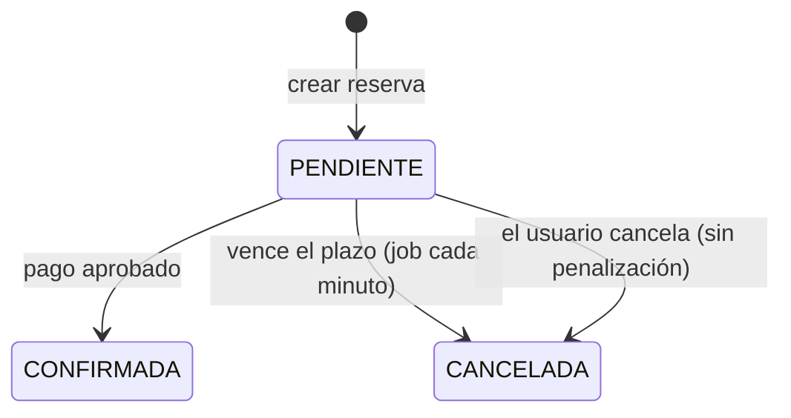

# 📐 Reglas de negocio

Reglas que aplica el sistema, verificadas contra el código. Los valores marcados con ⚙️ se pueden ajustar en `application.yml`; el resto están en el código de `BookingServiceImpl`.

**Contenido:** [Restricciones de reserva](#-restricciones-de-reserva) · [Precios dinámicos](#-precios-dinámicos) · [Membresías](#-membresías) · [Paquetes](#-paquetes-prepagados) · [Cancelaciones](#-cancelaciones-y-penalizaciones) · [Recurrentes](#-reservas-recurrentes) · [Pagos](#-pagos) · [Lista de espera](#-lista-de-espera) · [Check-in y no-show](#-check-in-y-no-show) · [Comunidad](#-comunidad) · [Reseñas](#-reseñas)

---

## 🕒 Restricciones de reserva

| Regla | Valor |
|---|---|
| Solapamiento en la misma cancha | **No permitido** (las reservas `PENDIENTE` de pago también ocupan la cancha) |
| Cancha bloqueada (mantenimiento, feriado o evento) | No se puede reservar en ese horario |
| Duración | Mínimo **1 h**, máximo **4 h** |
| Horario de operación | **06:00 – 23:00** |
| Anticipación mínima | **2 horas** antes del inicio |
| Anticipación máxima | Según la [membresía](#-membresías) |

Las reservas concurrentes sobre la misma cancha se **serializan con un bloqueo de fila** (también al reprogramar), por lo que dos personas no pueden tomar el mismo horario a la vez.

---

## 💸 Precios dinámicos

El precio parte de `precio base por hora × horas` y se multiplica por un factor que depende de la **fecha y de la hora de inicio**:

| Condición | Factor |
|---|---|
| Fin de semana (sábado o domingo) | × 1.3 |
| Horario pico **18:00 – 22:00** | × 1.5 |
| Horario valle **06:00 – 12:00** | × 0.8 |
| Resto del día | × 1.0 |

Los factores se **multiplican**: sábado en horario pico = 1.3 × 1.5 = **1.95**; sábado en horario valle = 1.3 × 0.8 = **1.04**.

Después se resta el descuento (membresía + recurrencia, ambos sobre el subtotal):

```text
subtotal = precio_base × horas × factor
descuento = subtotal × (descuento_membresía + 0.05 si es recurrente)
total = subtotal − descuento
```

### Ejemplo

Cancha a **S/ 100 por hora**, sábado 19:00, 2 horas, usuario **PREMIUN** (20 %):

| Paso | Cálculo | Resultado |
|---|---|---|
| Base | 100 × 2 | S/ 200.00 |
| Factor sábado + pico | × 1.3 × 1.5 | S/ 390.00 |
| Descuento de membresía | − 20 % | − S/ 78.00 |
| **Total** | | **S/ 312.00** |

Si además fuera una reserva recurrente: descuento 25 % → **S/ 292.50** por reserva.

---

## 🏅 Membresías

| Membresía (valor de API) | Descuento | Anticipación máxima |
|---|:---:|:---:|
| `NINGUNA` | 0 % | 7 días |
| `BASICA` | 10 % | 14 días |
| `PREMIUN` ¹ | 20 % | 30 días |
| `VIP` | 30 % | 30 días |

¹ El valor del enum se escribe `PREMIUN` (sin la segunda «M»); es el valor que acepta y devuelve la API.

**VIP** además cancela **sin penalización hasta 12 horas antes** (ver [cancelaciones](#-cancelaciones-y-penalizaciones)).

---

## 📦 Paquetes prepagados

Un paquete es una bolsa de **horas** con **vigencia** en días, que el administrador define (nombre, horas, precio, descuento, vigencia).

- El usuario **compra** un paquete y puede tener **varios activos**.
- Al reservar con paquete (`usesPackage` + `userPackageId`) se **descuentan las horas** de la reserva y el precio de la reserva queda en **S/ 0**.
- Si no alcanzan las horas, el paquete está vencido o no pertenece al usuario, la reserva se rechaza.
- **Vencimiento:** un job diario desactiva los paquetes vencidos; las horas no usadas se pierden.
- **Cancelación:** las horas se **devuelven** al paquete si la penalización aplicada es menor al 50 % (o sea, cancelando con al menos 12 h de anticipación) y el paquete no venció.
- Una reserva pagada con paquete **solo se puede reprogramar con la misma duración**.
- Las reservas pagadas con paquete se **confirman al instante**, incluso con el pago obligatorio activado.

---

## ❌ Cancelaciones y penalizaciones

Se calcula según las horas que faltan para el inicio:

| Anticipación | Penalización | Se devuelve |
|---|:---:|:---:|
| ≥ 24 horas | 0 % | 100 % |
| 12 – 24 horas | 30 % | 70 % |
| < 12 horas | 50 % | 50 % |
| **VIP** con ≥ 12 horas | 0 % | 100 % |
| Reserva **pendiente de pago** | 0 % | — |

- Solo se pueden cancelar reservas `CONFIRMADA` o `PENDIENTE`.
- En una reserva recurrente se puede cancelar **una sola** o **todas** las de la serie.
- Al cancelar una reserva confirmada se notifica al primero de la [lista de espera](#-lista-de-espera).

---

## 🔁 Reservas recurrentes

- Se crean reservas **semanales** para el mismo día y horario: de **2 a 12 semanas**.
- Si una fecha está **ocupada o bloqueada, se omite** y las demás se crean; la respuesta detalla cuáles fallaron.
- **Descuento adicional del 5 %** sobre cada reserva de la serie (se suma al de la membresía).

```text
Solicitud: todos los martes 18:00–20:00 durante 8 semanas
Resultado: 7 reservas creadas · 1 omitida (cancha ocupada la semana 3)
```

---

## 💳 Pagos

- El pago es **simulado**: métodos `TARJETA`, `YAPE_PLIN` y `EFECTIVO`. Una tarjeta que termina en **`0000`** se rechaza (útil para probar).
- Estados: `APROBADO`, `RECHAZADO`, `REEMBOLSADO`. Solo un pago `APROBADO` se puede reembolsar.
- El personal de sede solo ve y reembolsa pagos de **su sede**.

### Pago obligatorio (opcional) ⚙️

Con `app.business-rules.booking.require-payment=true`:



- El plazo es `payment-window-minutes` (15 por defecto). Mientras esté `PENDIENTE` la reserva **bloquea la cancha**.
- Vencido el plazo se cancela sola, se notifica al usuario y el horario queda libre.
- Un pago posterior al vencimiento se rechaza.
- Con el valor por defecto (`false`) las reservas se confirman al crearse.

---

## ⏳ Lista de espera

- Si un horario está ocupado, el usuario puede **anotarse** en la lista de esa cancha, fecha y horario.
- Cuando se cancela una reserva, se **notifica al primero de la cola (FIFO)**.
- Ese usuario tiene **30 minutos** ⚙️ para actuar; si no responde, se notifica al siguiente.
- Un job limpia periódicamente las solicitudes antiguas.

---

## ✅ Check-in y no-show

- Cada reserva tiene un **código de check-in** único (un UUID) que se muestra como QR al titular.
- El personal de la sede registra el ingreso **con el código y el ID de la reserva**, o **solo con el código** (lector de cámara).
- Un código solo se puede usar **una vez** y solo en reservas `CONFIRMADA`.
- **No-show:** el personal puede marcar una reserva confirmada sin check-in; se aplica una penalización del **100 %**.
- Las reservas confirmadas ya finalizadas pasan a `COMPLETADA` automáticamente (job horario).

---

## 🤝 Comunidad

**Partidos abiertos**
- Solo el **titular** de una reserva `CONFIRMADA` puede publicarla, una sola vez.
- Otros jugadores envían una **solicitud**; **solo el creador** las acepta o rechaza.
- El creador cuenta como jugador; el partido pasa a `COMPLETO` al llegar al máximo.

**Equipos**
- Cualquiera puede crear un equipo (queda como propietario).
- El propietario **invita por email**; el invitado **acepta o rechaza**. No hay altas sin consentimiento.
- No se puede invitar a alguien que ya es miembro ni duplicar una invitación pendiente.
- El propietario puede quitar integrantes; los demás pueden abandonar el equipo (el propietario no).

**Torneos**
- Inscripción abierta hasta que se **genera el fixture** (mínimo 2 inscritos): se crean todos contra todos (*round-robin*).
- Cada victoria suma **3 puntos**; **no se permiten empates**. El ranking ordena por puntos y victorias.
- Un torneo puede pertenecer a una **sede**: el personal de sede solo gestiona los de la suya; los torneos globales los gestiona el administrador.

---

## ⭐ Reseñas

- Solo se puede calificar una cancha **después de completar una reserva** en ella, **una vez por usuario y cancha**.
- Calificación de 1 a 5 con comentario opcional.
- El personal de la sede puede **ocultar** (deja de mostrarse públicamente), **volver a mostrar** o **eliminar** reseñas de sus canchas.
