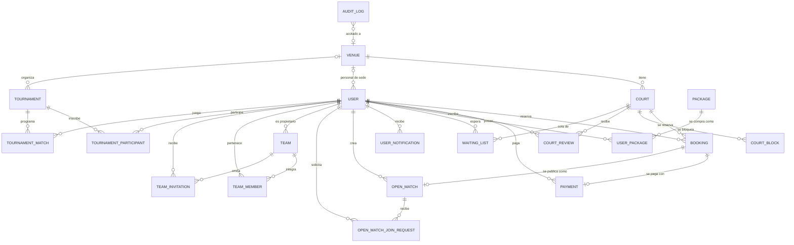
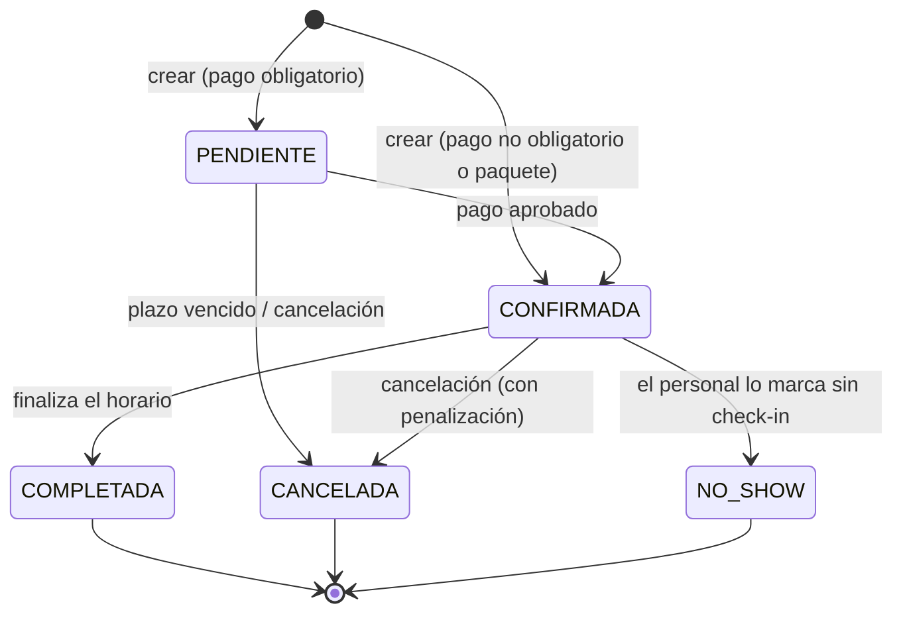

# 🗄️ Modelo de datos

El sistema tiene **20 tablas**. El esquema de producción lo crea Flyway (`src/main/resources/db/migration/V1__baseline_schema.sql`) y `FlywayMigrationTest` garantiza que coincide con las entidades JPA.

**Contenido:** [Diagrama entidad-relación](#-diagrama-entidad-relación) · [Tablas por módulo](#-tablas-por-módulo) · [Ciclo de vida de una reserva](#-ciclo-de-vida-de-una-reserva) · [Cómo cambiar el esquema](#-cómo-cambiar-el-esquema)

---

## 🧭 Diagrama entidad-relación



> `AUDIT_LOG` guarda `venue_id` como un número (sin clave foránea) y `actor_user_id` para reconstruir quién hizo cada acción.

---

## 📋 Tablas por módulo

### Organización

| Tabla | Descripción | Campos destacados |
|---|---|---|
| `venues` | Sedes | `name` (único), `address`, `active` |
| `courts` | Canchas | `sport_type`, `capacity` (2–50), `price_base_hour`, `venue_id`, `active` |
| `users` | Cuentas | `email` (único), `role`, `membership_type`, `venue_id` (solo personal de sede), `token_version`, `active` |
| `court_blocks` | Bloqueos por mantenimiento, feriado o evento | `court_id`, `block_date`, `start_time`, `end_time`, `type` |

### Reservas y pagos

| Tabla | Descripción | Campos destacados |
|---|---|---|
| `bookings` | Reservas | `status`, `base_price`, `dynamic_surcharges`, `applied_discount`, `total_price`, `check_in_code` (único), `payment_deadline`, `uses_package`, `parent_booking_id` (serie recurrente) |
| `payments` | Un pago por reserva | `booking_id` (único), `method`, `status`, `amount`, `operation_code` (único) |
| `packages` | Catálogo de paquetes | `amount_hours`, `price`, `discount_percent`, `validity_days` |
| `user_packages` | Paquetes comprados | `initial_hours`, `remaining_hours`, `expiration_date`, `active` |
| `waiting_list` | Cola de espera | `court_id`, `desired_date`, `desired_start_time`, `notified`, `notification_expiration_date` |

### Comunidad

| Tabla | Descripción |
|---|---|
| `court_reviews` | Reseñas (una por usuario y cancha) con `rating` 1–5 y `hidden` para moderación |
| `open_matches` · `open_match_join_requests` | Partidos abiertos (uno por reserva) y sus solicitudes |
| `teams` · `team_members` · `team_invitations` | Equipos, integrantes e invitaciones (`PENDIENTE`, `ACEPTADA`, `RECHAZADA`, `CANCELADA`) |
| `tournaments` · `tournament_participants` · `tournament_matches` | Torneos (con `venue_id` opcional), inscritos con puntos y partidos con marcador |

### Transversales

| Tabla | Descripción |
|---|---|
| `user_notifications` | Bandeja in-app: `type`, `title`, `message`, `is_read` |
| `audit_logs` | `action`, `resource_type`, `resource_id`, `actor_email`, `venue_id` |

---

## 🔄 Ciclo de vida de una reserva



Estados de un **pago**: `APROBADO` → `REEMBOLSADO`, o `RECHAZADO`.

---

## 🛫 Cómo cambiar el esquema

1. Modifica la entidad JPA.
2. Agrega una migración **nueva** en `src/main/resources/db/migration/` con el siguiente número (`V2__descripcion.sql`, `V3__…`). **Nunca edites una migración ya aplicada.**
3. Ejecuta `./mvnw test`: `FlywayMigrationTest` falla si la migración y las entidades no coinciden.

```sql
-- V2__add_court_photo.sql (ejemplo)
ALTER TABLE courts ADD COLUMN photo_url VARCHAR(300);
```

En desarrollo (H2) no hace falta migrar: Hibernate recrea el esquema en cada arranque.
