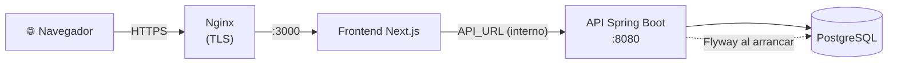

# 🚢 Guía de despliegue

Cómo poner la API en producción **sin Docker**: un servidor Linux con JDK 21, PostgreSQL y un proxy inverso con HTTPS.

**Contenido:** [Resumen](#-resumen) · [Requisitos](#-requisitos) · [1. Base de datos](#1--base-de-datos) · [2. Configuración](#2--configuración) · [3. Obtener el JAR](#3--obtener-el-jar) · [4. Primer arranque](#4--primer-arranque) · [5. Primer administrador](#5--crear-el-primer-administrador) · [6. Servicio systemd](#6--servicio-systemd) · [7. Proxy inverso y HTTPS](#7--proxy-inverso-y-https) · [8. Actualizaciones](#8--actualizaciones) · [Lista de verificación](#-lista-de-verificación) · [Problemas frecuentes](#-problemas-frecuentes)

---

## 🗺️ Resumen



- El **frontend** habla con la API desde su servidor; la API no necesita estar expuesta directamente a internet si el frontend corre en la misma red.
- Al arrancar con el perfil `prod`, **Flyway crea o actualiza el esquema** y Hibernate solo lo valida.

---

## ✅ Requisitos

| Componente | Versión |
|---|---|
| Java | JDK / JRE **21** |
| PostgreSQL | 14 o superior |
| Servidor | Linux con `systemd` (los pasos se adaptan a cualquier otro gestor de procesos) |
| Proxy inverso | Nginx (u otro) con un certificado TLS |

---

## 1. 🗄️ Base de datos

```sql
CREATE USER court_user WITH PASSWORD 'una-contraseña-larga-y-única';
CREATE DATABASE courtdb OWNER court_user;
```

Deja la base **vacía**: Flyway aplicará `V1__baseline_schema.sql` en el primer arranque.

---

## 2. 🔧 Configuración

Crea un archivo de entorno legible solo por el usuario del servicio, por ejemplo `/etc/court-reservation/api.env`:

```bash
SPRING_PROFILES_ACTIVE=prod
JWT_SECRET=<salida de: openssl rand -base64 32>
DB_URL=jdbc:postgresql://localhost:5432/courtdb
DB_USERNAME=court_user
DB_PASSWORD=una-contraseña-larga-y-única
CORS_ALLOWED_ORIGINS=https://reservas.tu-dominio.com
```

```bash
sudo chmod 600 /etc/court-reservation/api.env
```

| Variable | Notas |
|---|---|
| `JWT_SECRET` | **Obligatoria**, Base64 de ≥ 32 bytes. Si la cambias, todas las sesiones activas dejan de ser válidas |
| `CORS_ALLOWED_ORIGINS` | El origen **exacto** del frontend (varios, separados por coma) |
| `SPRING_PROFILES_ACTIVE` | Debe ser `prod`; sin él arranca en modo desarrollo con H2 y datos de prueba |

> Opcional: `app.business-rules.booking.require-payment=true` (variable `APP_BUSINESS_RULES_BOOKING_REQUIRE_PAYMENT=true`) activa el pago obligatorio para reservar.

---

## 3. 📦 Obtener el JAR

**Opción A: descargarlo de un Release** (recomendado). Al publicar una etiqueta, el CI adjunta el JAR:

```bash
git tag v1.0.0 && git push origin v1.0.0
# GitHub → Releases → court-reservation-system-<versión>.jar
```

**Opción B: compilarlo en el servidor**

```bash
git clone https://github.com/Rodrigo-Salva/court-reservation-api.git
cd court-reservation-api
./mvnw -DskipTests package
# → target/court-reservation-system-0.0.1-SNAPSHOT.jar
```

Cópialo a `/opt/court-reservation/court-reservation-system.jar`.

---

## 4. ▶️ Primer arranque

```bash
set -a; source /etc/court-reservation/api.env; set +a
java -jar /opt/court-reservation/court-reservation-system.jar
```

En el log verás a Flyway migrando y luego `Started CourtReservationSystemApplication`. Comprueba:

```bash
curl http://localhost:8080/actuator/health      # → {"status":"UP"}
```

---

## 5. 👑 Crear el primer administrador

En producción **no se cargan datos de prueba** y el registro público solo crea usuarios `USER`. El primer `ADMIN` se crea directamente en la base:

1. Genera el hash BCrypt de la contraseña (prefijo `$2a$`):

   ```bash
   htpasswd -bnBC 10 "" 'TuContraseñaSegura' | tr -d ':\n' | sed 's/^\$2y/$2a/'
   ```

2. Insértalo:

   ```sql
   INSERT INTO users (name, email, phone, password, role, membership_type, active, token_version, registration_date)
   VALUES ('Administrador', 'admin@tu-dominio.com', '999999999', '<hash bcrypt>', 'ADMIN', 'NINGUNA', true, 0, now());
   ```

3. Inicia sesión y, desde el panel, crea sedes, canchas y personal de sede (`POST /api/users/staff`). Cambia la contraseña inicial cuanto antes.

---

## 6. ⚙️ Servicio systemd

`/etc/systemd/system/court-reservation.service`:

```ini
[Unit]
Description=Court Reservation API
After=network.target postgresql.service

[Service]
User=court
EnvironmentFile=/etc/court-reservation/api.env
ExecStart=/usr/bin/java -Xmx512m -jar /opt/court-reservation/court-reservation-system.jar
Restart=on-failure
RestartSec=5
SuccessExitStatus=143

[Install]
WantedBy=multi-user.target
```

```bash
sudo useradd --system --no-create-home court
sudo systemctl daemon-reload
sudo systemctl enable --now court-reservation
sudo journalctl -u court-reservation -f          # logs
```

---

## 7. 🔒 Proxy inverso y HTTPS

Ejemplo de Nginx para publicar el **frontend** (que a su vez llama a la API por la red interna):

```nginx
server {
    listen 443 ssl http2;
    server_name reservas.tu-dominio.com;

    ssl_certificate     /etc/letsencrypt/live/reservas.tu-dominio.com/fullchain.pem;
    ssl_certificate_key /etc/letsencrypt/live/reservas.tu-dominio.com/privkey.pem;

    location / {
        proxy_pass http://127.0.0.1:3000;
        proxy_set_header Host $host;
        proxy_set_header X-Forwarded-Proto $scheme;
        proxy_set_header X-Forwarded-For $proxy_add_x_forwarded_for;
    }
}
```

```bash
sudo certbot --nginx -d reservas.tu-dominio.com   # certificado gratuito de Let's Encrypt
```

> 📷 **HTTPS es obligatorio** para que el lector de QR con cámara funcione fuera de `localhost`.

Si expones la API directamente, publícala igual detrás de TLS y limita el puerto 8080 con el firewall.

---

## 8. 🔄 Actualizaciones

1. **Respalda** la base: `pg_dump -Fc courtdb > backup-$(date +%F).dump`.
2. Sube la nueva versión del JAR y reinicia: `sudo systemctl restart court-reservation`.
3. Flyway aplica automáticamente las migraciones nuevas; verifica `curl …/actuator/health`.

**Reglas de oro:** una migración aplicada **nunca se edita** (se agrega una nueva) y los cambios de esquema se prueban antes con `./mvnw test`.

<details>
<summary><b>Ya tengo una base creada antes de usar Flyway</b></summary>

Si la base ya tiene las tablas, indícale a Flyway que la considere en la versión 1:

```bash
SPRING_FLYWAY_BASELINE_ON_MIGRATE=true
SPRING_FLYWAY_BASELINE_VERSION=1
```

Y aplica a mano las diferencias entre tu esquema y `V1__baseline_schema.sql` (por ejemplo `users.venue_id`, `users.token_version`, `bookings.payment_deadline`, `court_reviews.hidden`, `tournaments.venue_id`, `audit_logs.venue_id` y las tablas `team_invitations` y otras nuevas).

</details>

---

## 📋 Lista de verificación

- [ ] `SPRING_PROFILES_ACTIVE=prod`
- [ ] `JWT_SECRET` propio y guardado en un gestor de secretos
- [ ] PostgreSQL con usuario dedicado, respaldos programados y sin acceso público
- [ ] `CORS_ALLOWED_ORIGINS` con el dominio real del frontend
- [ ] HTTPS activo (necesario también para la cámara del QR)
- [ ] Primer `ADMIN` creado y contraseña cambiada
- [ ] `/actuator/health` monitoreado
- [ ] Puerto 8080 cerrado al exterior si hay proxy delante

---

## 🩺 Problemas frecuentes

| Síntoma | Causa y solución |
|---|---|
| Falla al arrancar con `Could not resolve placeholder 'JWT_SECRET'` | Falta la variable de entorno. Revisa el archivo `EnvironmentFile` |
| `JWT_SECRET debe tener al menos 32 bytes` o `debe estar codificado en Base64` | Genera el secreto con `openssl rand -base64 32` |
| `Schema-validation: missing column …` | La base no coincide con las entidades: falta aplicar una migración (o la base es anterior a Flyway; ver el bloque desplegable) |
| El navegador muestra errores CORS | `CORS_ALLOWED_ORIGINS` no coincide exactamente con el origen del frontend (esquema, dominio y puerto) |
| Todos los usuarios quedan deslogueados tras un despliegue | Cambió `JWT_SECRET`; es lo esperado |
| Login responde `429` | Se superaron los 5 intentos fallidos; espera el tiempo de `Retry-After` (15 min) |
